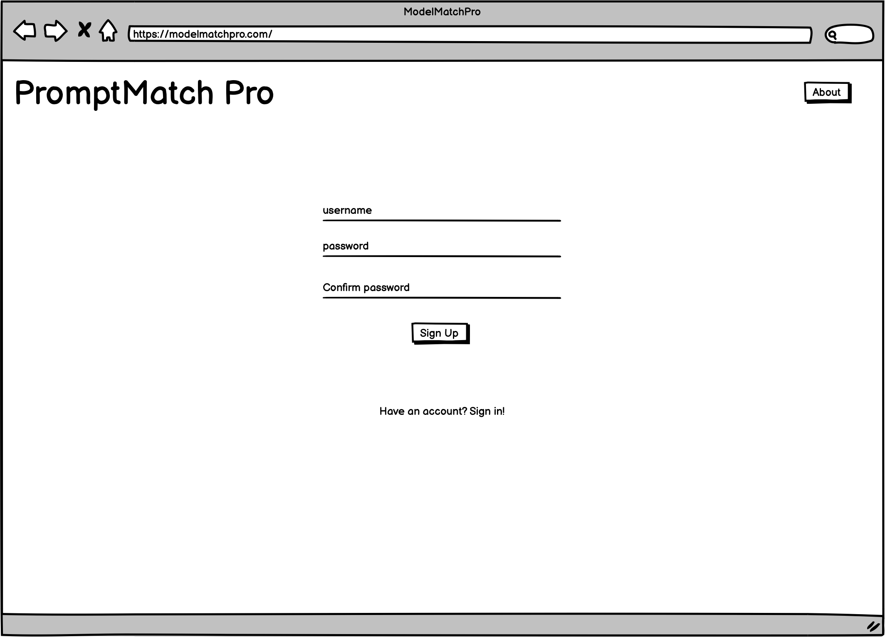
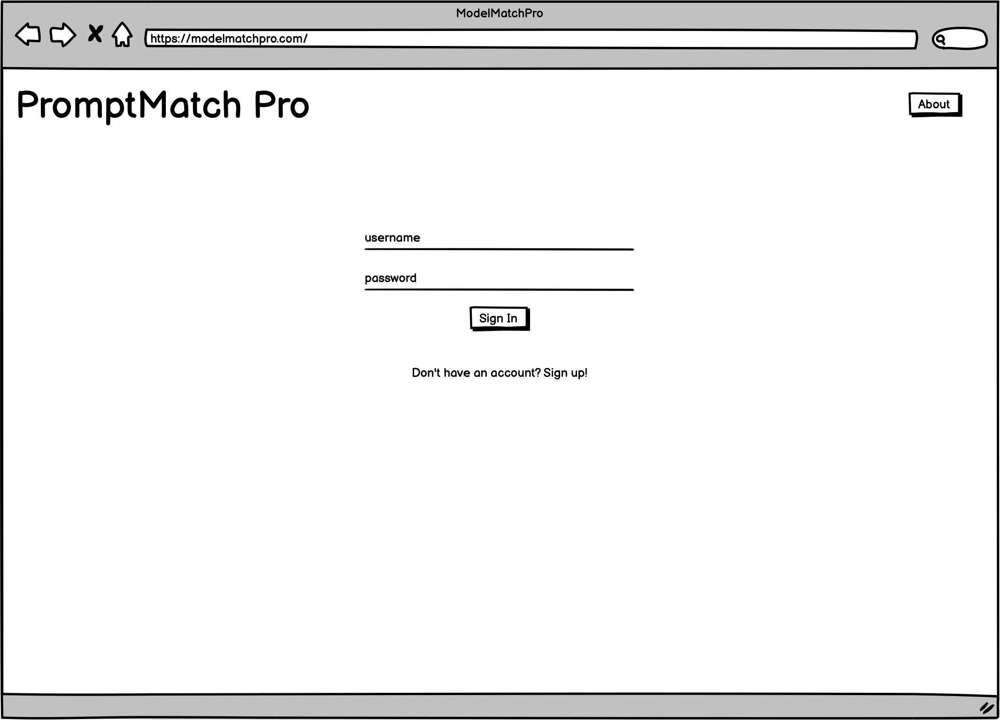
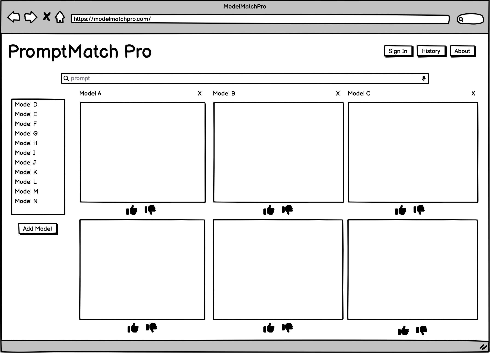
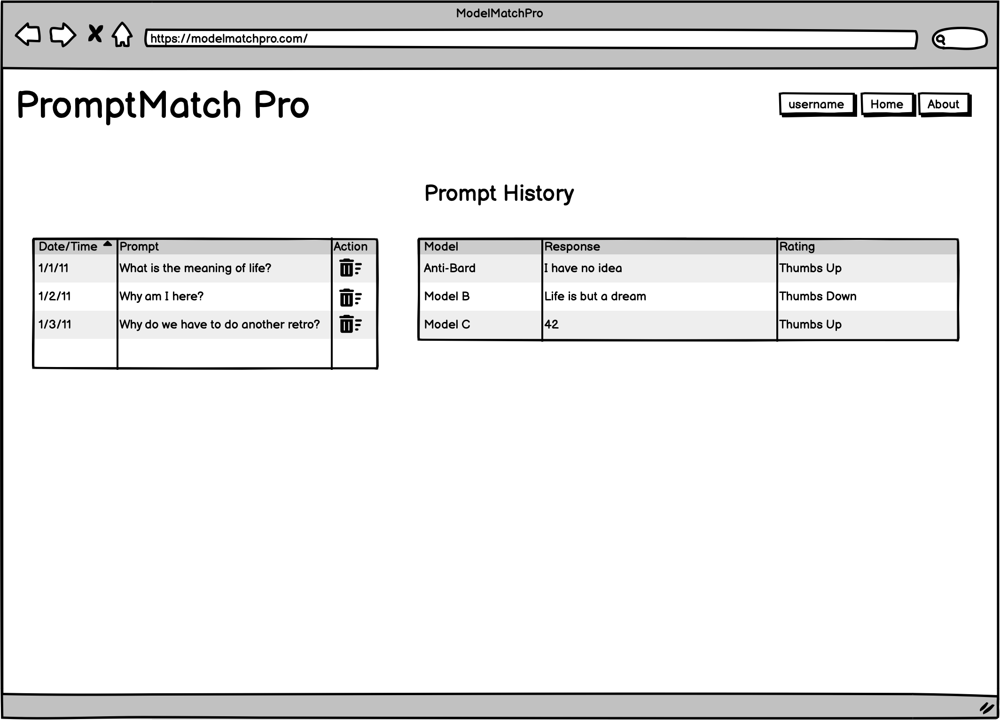
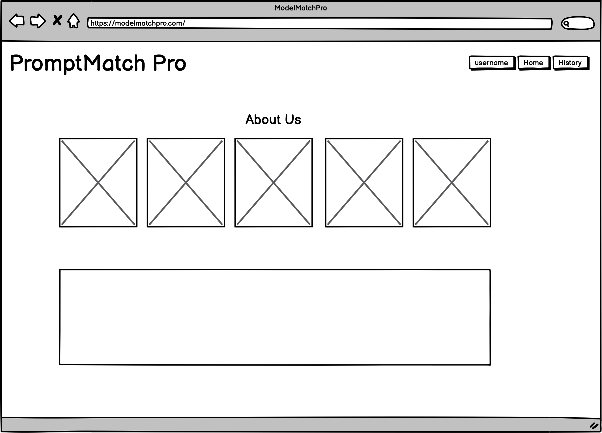

## Software Requirements

### Vision

What is the vision of this product?

Model match pro will allow to developers to compare several models simultaneously to see which ones best match their use case.

What pain point does this project solve?

With the proliferation of large language models, many users pick their favorite and then try to engineer their prompts to work for their use case. Currently, there are very few, if any, applications that allow users to compare results from multiple LLMs. 

Why should we care about your product?

We will be one of the few products to bring together a method to compare results from multiple LLMs. 

### Scope (In/Out)

IN - What will your product do? 
Describe the individual features that your product will do.
High overview of each. Only need to list 4-5:

1. Authenticate users
2. Query the users prompt against three large language models
3. Allow the user to select from several other LLMs to also query their prompt
4. Maintain a history of the user's requests 

OUT - What will your product not do.

These should be features that you will make very clear from the beginning that you will not do during development. These should be limited and very few. Pick your battles wisely. This should only be 1 or 2 things. Example: My website will never turn into an IOS or Android app.

1. No voice activation
2. No image searches
3. English only at this time

### Minimum Viable Product vs

What will your MVP functionality be?

1. Django full stack web app
2. 3 tier with next.js front end
3. Be deployed
4. Have tests
5. Authenticate users
6. Query the users prompt against three large language models
7. Allow the user to select from several other LLMs to also query their prompt
8. Maintain a history of the user's requests 

What are your stretch goals?

1. Allow the user to rate the responses from various models
2. Allow the user to edit their history 
3. Allow the user to edit and/or resubmit an existing query 

### Stretch

What stretch goals are you going to aim for?

We intend to aim for all three goals above and map our db in that manner

### Functional Requirements

List the functionality of your product. 

1. Django full stack web app
2. 3 tier with next.js front end
3. Be deployed
4. Have tests

### Data Flow

Describe the flow of data in your application. Write out what happens from the time the user begins using the app to the time the user is done with the app. Think about the “Happy Path” of the application. Describe through visuals and text what requests are made, and what data is processed, in addition to any other details about how the user moves through the site.

1. user signs up
2. user signs in with their credentials
3. user enters a prompt, select models if desired, and clicks on submit
4. a) user may select additional or different models for the same prompt and re-run the query
4. b) user may enter a new prompt and/ or new models and continue submitting queries
5. user reviews history
5. a) user may edit items in the history
5. b) user may re-submit items in the history, potential (stretch) to select new models for this query
6. user logs out

### Non-Functional Requirements (301 & 401 only)

Non-functional requirements are requirements that are not directly related to the functionality of the application but still important to the app.

- Security --We want to be able to authenticate users, since this is an API call to Hugging Face. Passwords that we store in our db will be hashed

- Collaboration--effective communication, sharing of insights, and teamwork! 

- Extendability--development and plan so that additional features can be added as time allows 

### Wireframe

## Project Management Board and User Stories in Trello

[Trello](https://trello.com/b/KQ43ftez/model-match-pro)

## Domain Modeling

